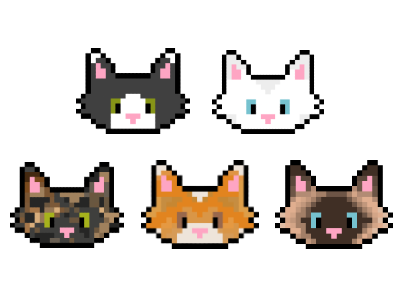

# TapTheCat 😼
A cat themed clicker game written in Java using Swing components and Object Oriented Programming concepts.

## How to play 😸
Click the ***kitten*** to obtain Kibbles! (1 click = 1 Kibble)

Use Kibbles to buy click multipliers ***(ZOOMIES)*** and clicks-per-second ***(FEEDERS)*** which will help you gain Kibbles faster!

There are 5 unlockable levels including endgame. 

Every unlockable level requires a number of Kibbles.

Unlock all levels to win the game!

## How to install and run TapTheCat 😻

Firstly, you have to download the installer from the [Releases](https://github.com/septimium/TapTheCat/releases) page.

***CAREFUL!*** Click on the *.exe* file to download the installer. Source code is not needed for installation.

After the executable was downloaded, install the game by running the file.

Shortly after the installation is done, a shortcut will be placed on your Desktop.

That's it. Run the game by using the shortcut and enjoy tapping!
